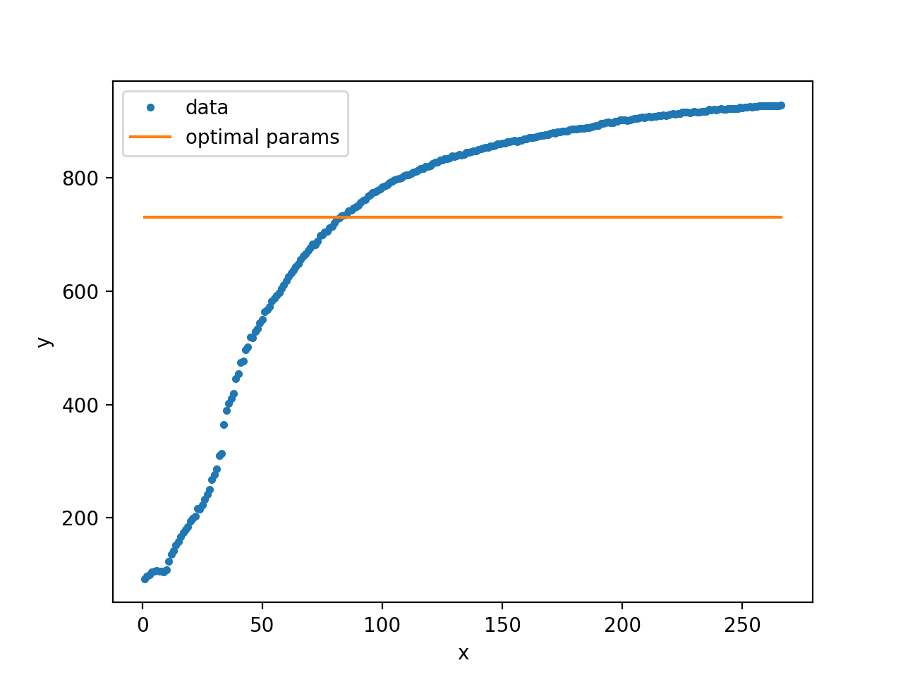
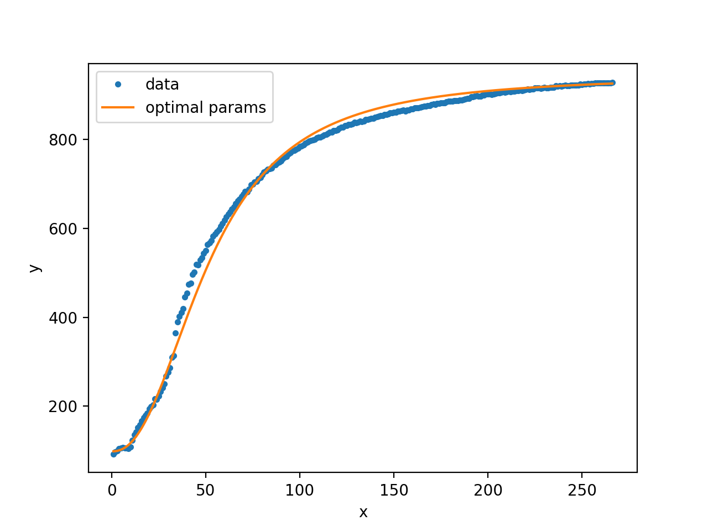
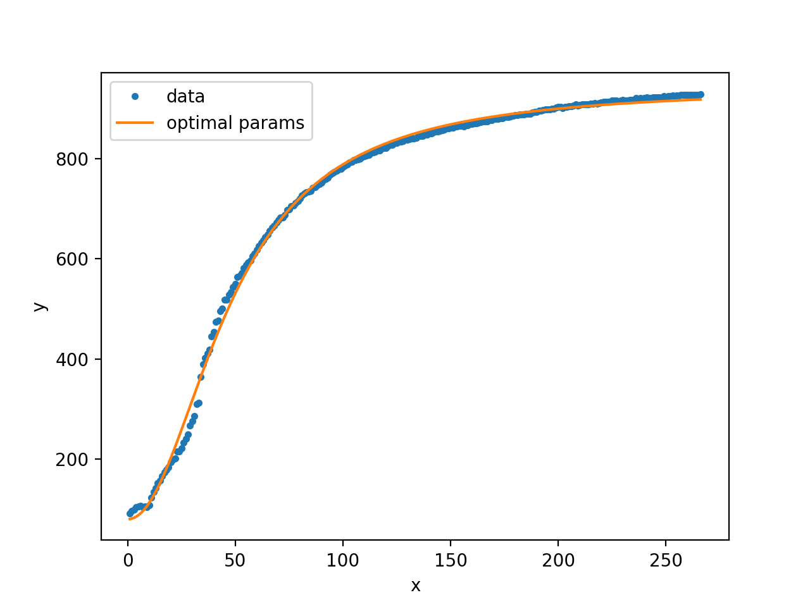

- [Introduction](#introduction)
- [Motivation](#motivation)
  - [What is a parameter?](#what-is-a-parameter)
  - [Why do we want to optimize parameters?](#why-do-we-want-to-optimize-parameters)
  - [Mortivation](#mortivation)
- [Theory](#theory)
  - [Gradient descent](#gradient-descent)
  - [Finding $t$](#finding-t)
  - [Newton's method](#newtons-method)
  - [A combined approach](#a-combined-approach)
  - [Local vs global minima](#local-vs-global-minima)
- [Parameter optimization](#parameter-optimization)
  - [The error function](#the-error-function)
  - [Differentiating the error function](#differentiating-the-error-function)
- [Omega Optimizer](#omega-optimizer)
  - [The datafile](#the-datafile)
  - [Initial parameter GUI](#initial-parameter-gui)
  - [Symbolic math with sympy](#symbolic-math-with-sympy)
  - [Omega Optimizer in action](#omega-optimizer-in-action)
  - [Conclusion and further developments](#conclusion-and-further-developments)
- [Addendum: the `rust_code` problem](#addendum-the-rust_code-problem)

## Introduction

I have long been interested in how to find the optimal parameters to approximate experimental data. I have created many projects with the goal of optimizing parameters automatically, and with my latest version, aptly named *Omega Optimizer*, I feel like I finally have something that works. In this blogpost I want to explain what parameter optimization is, how you can do it numerically, and how my *Omega Optimizer* works.

## Motivation

### What is a parameter?

So, if we are optimizing parameters, a good question is, what *is* a parameter? Let us look at the function $f(x) = ax + b$. This is the equation for a line with intercept $a$ and slope $b$. Here $x$ is the variable, and $a$ and $b$ are parameters. We can think about this as a parameterized function, where we typically write $f(x; a, b)$ to indicate that we also want to vary the parameters.

### Why do we want to optimize parameters?

So, why do we want to optimize parameters? Many times, when doing experimental physics, you know which function describes what you are measuring, but want to find the parameters. For instance, Ohm's law says $U = RI$, so if we want to find the resistance of a resistor, we can measure the voltage over the resistor as we vary the current. We then have the function 
$$U(I; R) = RI$$
and want to find $R$. This is called linear regression, and it is quite easy. There are formulas that give the optimal slope and the intercept for any linear regression problem. In fact, using linear algebra we can find the exact optimal parameters for any function of the form
$$
    f(x; a_1, a_2, \ldots, a_n) = a_1g_1(x) + a_2g_2(x) + \cdots + a_ng_n(x)
$$
where $a_1, a_2, \ldots, a_n$ are parameters and $g_1, g_2, \ldots, g_n$ are functions that only depend on $x$.

The problem is then non-linear regression. What if your parameters are in another function, like $f(t; \omega) = \sin(\omega t)$. Here you can use more specific methods, in the above case you can use a Fourier transform to find $\omega$, but to have a general parameter optimizer we need numerical methods.

### Mortivation

In this blogpost I want to use a real-world example to show how a parameter optimizer could be useful. One day my brother sent me this image:


along with the question "What function is this, and how do I linearize it?"

These two questions are linked, if I can find a function $f(x)$ that describes the curve, the inverse $f^{-1}(x)$ will linearize the data. The question is then, what function is it? It acts a bit like $\frac{x}{x+1}$. Specifically, it looked like $\frac{x^3}{x^3+1}$:


I therefore hypothesized that the data could be described by the function 
$$f(x; a, b, c, n) = \frac{ax^n}{bx^n + 1} + c$$

This is a non-linear regression problem! When I solved this problem for my brother initially, I used my then newly developed parameter optimizer, but it could not find the optimal parameters, so I found them manually instead. This was a big part of my motivation for this new parameter optimizer, to make sure it worked I tested it on this function, and it gave better parameters than I found manually.

## Theory

### Gradient descent

So, how do you solve optimization problems numerically? If you have ever had a linear algebra course, you probably know that the gradient of a function points in the direction of steepest ascent. Conversely, the negative of the gradient points in the direction of steepest descent. We can use this to find the minimum of a function; if we calculate the gradient at a point, we can follow the negative of the gradient to find a new point, which will have a lower function value. Repeat this enough times, and you will reach the minimum. This algorithm is called gradient descent.
More precisely, if you have a multivariable function $f(\vec{x})$ and an initial position $\vec{x}_0$, the value $\vec{x}_1 = \vec{x}_0 - t \nabla f(\vec{x}_0)$ will have the property $f(\vec{x}_1) \leq f(\vec{x}_0)$. The sequence defined by $\vec{x}_{n+1} = \vec{x}_n - t\nabla f(\vec{x}_n)$ will therefore converge to a minimum value $\vec{x}_{\min}$ where $\nabla f(\vec{x}_{\min}) = 0$. You might have noticed that a variable has suddenly appeared, the $t$ we multiply the gradient with is called the step size. This value is very important, if it is too small, the descent will converge to the minimum very slowly, and if it is too large, the descent will actually diverge.

### Finding $t$

There are many ways of finding $t$. We can do it using a line search, that is, we find the $t$-value that minimizes $f(\vec{x} - t\nabla f(\vec{x}))$ by finding the zeros of the directional derivative  
$$\nabla f(\vec{x} - t\nabla f(\vec{x})) \cdot \frac{\nabla f(\vec{x})}{|\nabla f(\vec{x})|}$$
This works, but it is quite slow. It uses few steps, but each step takes a lot of time.

The thing about $t$ is that you want it to be as large as possible, but if it is too large, $f(\vec{x} - t\nabla f(\vec{x})) > f(\vec{x})$. This means that for each step, we can double $t$ until the function value increases, or similarly, if the initial $t$-value was too large, halve $t$ until the function value no longer increases. This way, each step will use a large, but not too large $t$-value. This will not find the optimal $t$, but you require less computation for each step, so it is faster overall.

### Newton's method

While gradient descent works, it does not converge to the minima particularly quickly. There is another method that converges incredibly quickly, but it has a few caveats.

You might have seen Newton's method for finding the zeros of a function. The sequence 
$$x_{n+1} = x_n + \frac{f(x_n)}{f'(x_n)}$$
will converge to a $x_{\text{zero}}$ where $f(x_{\text{zero}}) = 0$, as long as the initial value $x_0$ is sufficiently close to $x_{\text{zero}}$. We are interested in the minimum value, not the zeros, but we can here use that $f'(x) = 0 \implies f(x)$ is an extremum. We can therefore use the sequence 
$$x_{n+1} = x_n + \frac{f'(x_n)}{f''(x_n)}$$
to find extrema. This finds the minimum if $f''(x_0) > 0$, and the maximum if $f''(x_0) < 0$.

Newton's method also works for multivariable functions. If we substitute the gradient for the derivative, and the hessian for the double derivative, we get the sequence 
$$\vec{x}_{n+1} = \vec{x}_n + (\bold{H}f(\vec{x}_n))^{-1} \cdot \nabla f(\vec{x}_n)$$

To recap, if you have a multivariable function $f(x, y)$, the gradient is 
$$
\def\arraystretch{1.4}
\nabla f(x, y) = \begin{bmatrix} \frac{df}{dx} \\ \frac{df}{dy}\end{bmatrix}
$$
and the hessian is
$$
\def\arraystretch{1.6}
Hf(x, y) = \begin{bmatrix} \frac{d^2f}{dx^2} & \frac{d^2f}{dxdy}\\ \frac{df^2}{dydx} & \frac{df^2}{dy^2} \end{bmatrix}
$$
This obviously extends to more variables.

There are two main downsides to Newton's method. The first is the hessian, if you have many variables, the hessian is going to be quite large, and finding the inverse is computationally expensive. Finding the inverse of a $n \times n$ matrix is $O(n^3)$. This is not a problem for parameter optimization, as you typically do not have a lot of parameters. The bigger problem is that Newton's method finds an extremum, not necessarily the minimum. This means that it might find a maximum or a saddle point instead. To reach the minimum you need to start close to the minimum. Specifically, you need the hessian to be positive definite at $x_0$ (the multivariable extension of $f''(x_0) > 0$).

### A combined approach

Gradient descent is a robust algorithm, it will typically converge to a minimum even if your initial value is far away, but it converges to the minimum slowly. Newton's method is not robust, if your initial value is far away from the minimum it might diverge or act erratically, but if it does converge, it does so rather quickly. The logical thing to do is then to use both methods. You can start with a few steps with gradient descent to come close enough to the minimum for Newton's method to work. You can then use Newton's method on the result of the gradient descent to quickly reach the minimum value.

### Local vs global minima

Both gradient descent and Newton's method will find a minimum, but not necessarily the global minimum. To avoid local minima, you can add "weight" to your gradient descent. One such modification is called "Nesterov accelerated gradient descent":
$$
    \begin{align*}
        \vec{v}_{n+1} &= \gamma \vec{v}_n + t\nabla f(\vec{x}_n - \gamma \vec{v}_n) \\
        \vec{x}_{n+1} &= \vec{x}_n - \vec{v}_{n+1} 
    \end{align*}
$$
Where $\gamma$ is a term representing the "momentum" of the descent, typically set to $0.9$ .

I have not seen the need to add weight to my parameter optimizer, the way I chose to avoid local minima is to start with an initial value close enough to the global minimum. For parameter optimization, we can use the fact that it is easy to visually see if the parameters are correct or not, so you can manually change parameter values manually until you have something that looks somewhat correct, and then use the parameter optimizer to find the true minimum.

## Parameter optimization

### The error function

I have now written a lot about general multivariable functions, but how will this help us with parameter optimization? Which function do we want to find the minimum of? Here we need to specify what we actually want to do. 

We have experimentally measured some data, we have measured a set of results $\{f_i\}$ at positions $\{x_i\}$. We know that the data should conform to some function $f(x; a_1, a_2, \ldots, a_n)$. We define the parameter vector $\vec{a} = (a_1, a_2, \ldots, a_n)$, and want to find the parameter vector $\vec{a}_{\min}$ such that $f(x_i; \vec{a}_{\min})$ most closely matches $f_i$ for each $i$. More specifically, we want to minimize the distance $|f_i - f(x_i;\ \vec{a})|$ for each $i$. We then define the function 
$$
e(\vec{a}) = \sum\limits_i |f_i - f(x_i;\ \vec{a})|
$$
This is almost our error function, but there is one problem, we want to differentiate the error function, but the absolute value function is not nice to differentiate. We therefore want to square the difference instead:
$$
   E(\vec{a}) = \sum\limits_i (f_i - f(x_i;\ \vec{a}))^2
$$
This is our error function, the function we want to minimize. Note that this is not the same function as $e(\vec{a})^2$, the minima of $e(\vec{a})$ will also be minima of $E(\vec{a})$, but we are adding additional weight to large differences.  

### Differentiating the error function

To use gradient descent and Newton's method, we need to find both $\nabla E$ and $\bold{H} E$. We start with the gradient:

$$
    \begin{align*}
        \frac{dE}{da_k} &= \frac{d}{da_k}
        \left(\sum\limits_i (f_i - f(x_i;\ \vec{a}))^2\right) \\
        &= \sum\limits_i \frac{d}{da_k}(f_i - f(x_i;\ \vec{a}))^2 \\
        &= -2\sum\limits_i (f_i - f(x_i;\ \vec{a}))\frac{df}{da_k} \\
        \implies \nabla E(\vec{a}) &= -2\sum\limits_i (f_i - f(x_i;\ \vec{a}))\nabla f(x_i;\ \vec{a}) \\
    \end{align*}
$$

We can then find the hessian:
$$
    \begin{align*}
        \frac{dE}{da_l da_k} &= \frac{d}{da_l}\left(-2\sum\limits_i (f_i - f(x_i;\ \vec{a}))\frac{df}{da_k}\right) \\
        &= -2\sum\limits_i \frac{d}{da_l}\left((f_i - f(x_i;\ \vec{a}))\frac{df}{da_k}\right) \\
        &= -2\sum\limits_i -\frac{df}{da_l}\frac{df}{da_k} + (f_i - f(x_i;\ \vec{a}))\frac{df}{da_l da_k} \\
        \implies \bold{H} E(\vec{a}) &= 2\sum\limits_i \nabla f\cdot \nabla^T f - (f_i - f(x_i;\ \vec{a}))Hf \\
    \end{align*}
$$

Now we have everything we need to create a program that optimizes parameters.

## Omega Optimizer

### The datafile

The parameter optimizer needs both your data and the parameterized function you think describes the data. The *Omega Optimizer* reads data where the first line is your function defined with a combination of math and python syntax. The next line is either the start of space separated x-y pairs, or an optional line for parameter values you know the approximate value for. For our example function, the datafile would look like this:
```
f(x; a, b, c, n) = a*x**n/(b*x**n + 1) + c
c=90
1 92
2 97
 ..
265 928
266 929
```
Here we have set c to $90$ as it is easy to see that this is around where the function crosses the y-axis, but as I said, that line is optional.

### Initial parameter GUI

For parameters not initialized in the datafile, the Parameter Optimizer defaults to 1. For simple (and even some complicated) functions this is fine, but in some cases, you need to be closer to the optimal parameters. To solve this problem, I have made a simple GUI that shows how the function looks like with a specific set of parameters overlaid on top of your dataset, and input fields where you can change the parameter values to immediately see how that affects the function:


### Symbolic math with sympy

To use our optimization algorithms, we need both the gradient and the hessian of our function. The problem is that for complicated functions, the gradient and hessian are ugly, and it would be unreasonable to expect the user to symbolically calculate them both before using the program. For instance, with our example function 
$$f(x) = \frac{ax^n}{bx^n + 1} + c$$
the gradient is
$$
    \def\arraystretch{1.4}
    \nabla f(x) = \left[\begin{matrix}\frac{x^{n}}{b x^{n} + 1} \\ - \frac{a x^{2 n}}{\left(b x^{n} + 1\right)^{2}} \\ 1 \\ \frac{a x^{n} \log{\left(x \right)}}{\left(b x^{n} + 1\right)^{2}}\end{matrix}\right]
$$
and the hessian is
$$
    \bold{H} f(x) = \def\arraystretch{1.6}
    \left[\begin{matrix}0 & - \frac{x^{2 n}}{\left(b x^{n} + 1\right)^{2}} & 0 & \frac{x^{n} \log{\left(x \right)}}{\left(b x^{n} + 1\right)^{2}}\\- \frac{x^{2 n}}{\left(b x^{n} + 1\right)^{2}} & \frac{2 a x^{3 n}}{\left(b x^{n} + 1\right)^{3}} & 0 & - \frac{2 a x^{2 n} \log{\left(x \right)}}{\left(b x^{n} + 1\right)^{3}}\\0 & 0 & 0 & 0\\\frac{x^{n} \log{\left(x \right)}}{\left(b x^{n} + 1\right)^{2}} & - \frac{2 a x^{2 n} \log{\left(x \right)}}{\left(b x^{n} + 1\right)^{3}} & 0 & \frac{a x^{n} \left(- b x^{n} + 1\right) \log{\left(x \right)}^{2}}{\left(b x^{n} + 1\right)^{3}}\end{matrix}\right]
$$

So, if we do not want to do math by hand, what do we do? We get the computer to do it for us! The python package *sympy* can do symbolic math automatically using magic, magic so complicated that no comparable programs exist for other programing languages. The problem with this is that python is slow, so while we need to use sympy to differentiate our function, we do not want to use python to do the actual parameter optimization. I would typically use c++ for fast computation, but I want to learn rust, so *Omega Optimizer* is written in rust. Luckily, sympy can turn your symbolic expression into rust code, with a little caveat, so we can use sympy for symbolic calculation, turn our symbolic expression into rust code, compile the rust program, and then finally run the actual parameter optimization. This does add a lot of preprocessing, but the nice thing is that only needs to be done once, so if you want to try with many different initial parameters, that does not add any computation time. 

### Omega Optimizer in action

It is finally time to test the Omega Optimizer. If we run it on our example problem without finding initial parameters, this is what we get:



This is a straight line is a typical local minimum, so this is not an unexpected result. The error here is obviously large, the relative error (sum of squared differences divided by number of datapoints) is `58973.4`. In this case you can visually see that we did not get the optimal initial parameters, another tell is that Newton's method acted up, instead of decreasing the error, it increased it massively, probably searching for a maximum that does not exist.

To find the optimal parameters, we need better initial values, and luckily, I already found a good set when helping my brother. The initial parameters I found then were 
```
(a, b, c, n) = (0.09, 0.0001063, 98, 2.32)
```
but even with these parameters we get no improvement:



Here it is harder to tell that we have not reached the minimum, but Newton's method did not want to play nice here either, it was again looking for a non-existent maximum. It seems like the parameters I found were another local minimum, and we get the relative error `343.4` Everything is not hopeless however, if we go back to the parameter GUI and find some new initial parameters:
```
(a, b, c, n) = (0.26, 0.0003, 95, 2)
```
Newton's method finaly acts nice, and we get:



This does not look like a big improvement, but the relative error is now `140.5`, that means that this set of parameters is actually more than twice as good as the previous set, and I could finally give my brother a proper answer to his question: the optimal parameters for linearizing his data is
```
(a, b, c, n) = (0.285, 0.000331, 80.4, 2.07)
```

### Conclusion and further developments

As you might tell by the example I used, *Parameter Optimizer* can be a bit finnicky to use. As I said, that is an exceptionally difficult problem to solve, but still. It is understandable that the program does not work when we have not set any initial parameters, but it really should have worked with the first set of initial parameters. So, how do we fix that? I do not know. The program is written in Rust, so it is fast. This means that I can run the descent algorithm many times in a row. The goal is then to figure out a way of approaching a good set of initial parameters using a random walk or a similar algorithm.

For now though, I have achieved what I set out to do. I finally found the true initial parameters for the problem my brother sent me many months ago. He was happy with the parameters I found manually of course, they were good enough for his use case, but the fact that I could not find the true optimal parameters was bothering me. *Parameter Optimizer* is also a useful tool to have in the future, if I ever get another parameter optimization problem I must solve, I have the means to do so quickly.

If you want to look at the source code for *Parameter Optimizer*, it is available at [my github](https://github.com/Emilinya/OmegaOptimizer).

## Addendum: the `rust_code` problem

While the sympy function `sympy.printing.rust.rust_code` almost does what we want, it has a small but fatal flaw, it does not respect types. Rust is incredibly strict with it's types, it does not like to convert floats to ints or ints to floats. For a simple example we can imagine a program that differentiates a function and creates a rust function named `df`. If we use this program on $x^2$, it might look like this:
```python
import sympy as sp
from sympy.printing.rust import rust_code

x = sp.symbols("x", float=True)
f = x**2
df = sp.diff(f, x)

print(f"""\
fn df(x: f64) -> f64 {{
    return {rust_code(df)};
}}\
""")
```
this will create rust code
```rust
fn df(x: f64) -> f64 {
    return 2*x;
}
```
however, this will give the error
```
return 2*x;
        ^ no implementation for {integer} * f64
```
So I had to create a function that added a `_f64` to numbers where needed.

