[c1]: # (To convert this to html, use the following command:)
[c2]: # (pandoc optimization.md -o optimization.html --mathjax -s -css=style.css --highlight-style breezedark)

## Table of contents

- [Introduction](#introduction)
- [Motivation](#motivation)
  - [What is a parameter?](#what-is-a-parameter)
  - [Why do we want to optimize parameters?](#why-do-we-want-to-optimize-parameters)
  - [Mortivation](#mortivation)
- [Numerical methods](#numerical-methods)
  - [Newton's method](#newtons-method)
  - [Damped Newton](#damped-newton)
  - [Gradient descent](#gradient-descent)
  - [Backtracking line search](#backtracking-line-search)
  - [Improved backtracking line search](#improved-backtracking-line-search)
  - [A combined approach](#a-combined-approach)
  - [Local vs global minima](#local-vs-global-minima)
- [Parameter optimization](#parameter-optimization)
  - [The error function](#the-error-function)
  - [Differentiating the error function](#differentiating-the-error-function)
  - [Uncertainty estimation](#uncertainty-estimation)
    - [Assumptions](#assumptions)
    - [Covariance](#covariance)
- [Omega Optimizer](#omega-optimizer)
  - [Normal distribution](#normal-distribution)
  - [Sine wave](#sine-wave)
  - [Mortivated](#mortivated)
  - [Conclusion and further developments](#conclusion-and-further-developments)
- [How it is actually done](#how-it-is-actually-done)

## Introduction

I have long been interested in how to find the optimal parameters to approximate experimental data. I have created many projects with the goal of optimizing parameters automatically, and with my latest version, aptly named *Omega Optimizer*, I feel like I finally have something that works. In this blog post I want to explain what parameter optimization is, how you can do it numerically, and how my *Omega Optimizer* works.

## Motivation

### What is a parameter?

If we are optimizing parameters, a good question is, what *is* a parameter? Let us look at the function $f(x) = ax + b$. This is the equation for a line with intercept $a$ and slope $b$. Here, $x$ is the variable, and $a$ and $b$ are parameters. We can think about this as a parameterized function, where we typically write $f(x; a, b)$ to indicate that we also want to vary the parameters.

### Why do we want to optimize parameters?

Many times when doing experimental physics, we know which function describes what we are measuring, but want to find its parameters. For instance, Ohm's law says $U = RI$, so if we want to find the resistance of a resistor, we can measure the voltage over the resistor as we vary the current. We then have the function 
$$
  U(I; R) = RI,
$$
and want to find $R$. This is called linear regression, and it is quite easy; there are formulas that give the optimal slope and intercept for any linear regression problem. In fact, using linear algebra we can find the exact optimal parameters for any function of the form
$$
    f(x; a_1, a_2, \ldots, a_n) = a_1g_1(x) + a_2g_2(x) + \cdots + a_ng_n(x),
$$
where $a_1, a_2, \ldots, a_n$ are parameters and $g_1, g_2, \ldots, g_n$ are functions that only depend on $x$.

The problem is then non-linear regression. What if your parameters are in another function, like $f(t; \omega) = \sin(\omega t)$? In this particular case you can use a Fourier transform to find $\omega$, and in general there are often approaches that give you the parameters, but they are heavily dependent on the specific optimization problem you have. To create a general non-linear parameter optimizer, we must instead turn to numerical methods.

### Mortivation

In this blog post I want to use a real-world example to show how a parameter optimizer can be useful. One day my brother sent me this image:

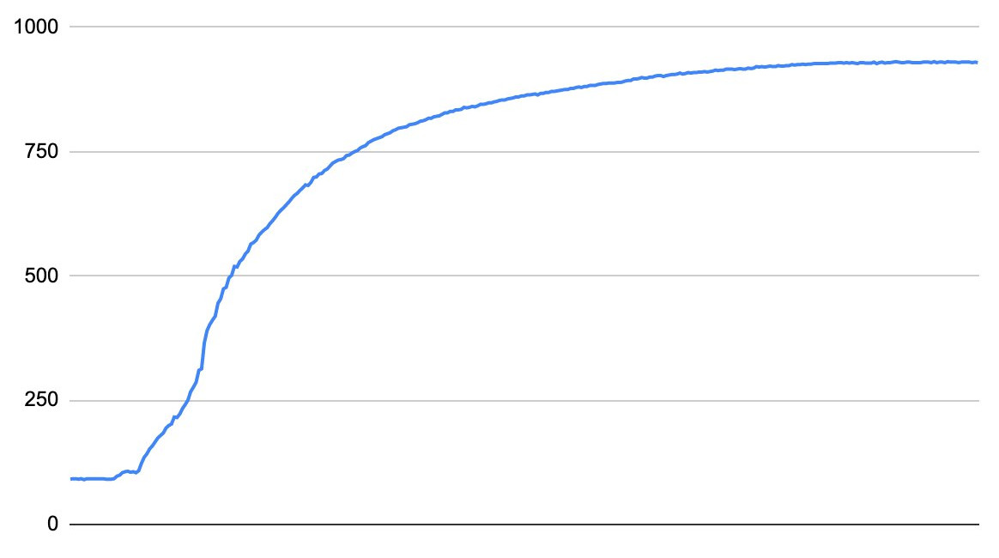

along with the question "What function is this, and how do I linearize it?". These two questions are linked, if I can find a function $f(x)$ that describes the curve, the inverse $f^{-1}(x)$ will linearize the data. The question is then, what function is it? It acts a bit like $\frac{x}{x+1}$. Specifically, it looked like $\frac{x^3}{x^3+1}$:

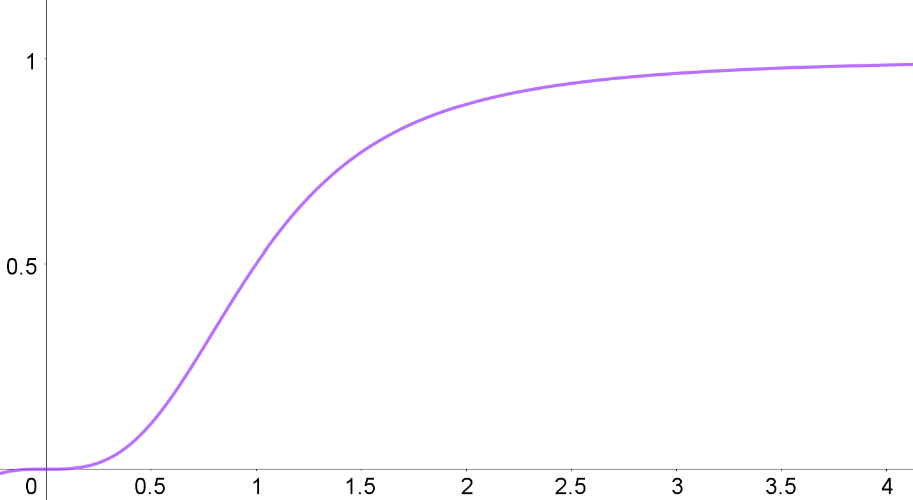

I therefore hypothesized that the data could be described by the function 
$$f(x; a, b, c, n) = \frac{ax^n}{bx^n + 1} + c.$$

This is a non-linear regression problem! When I solved this problem for my brother initially, I used my then newly developed parameter optimizer, but it could not find the optimal parameters, so I found them manually instead. This was a big part of my motivation for this new parameter optimizer, and I am happy to report that *Omega Optimizer* managed to find better parameters than I found manually.

## Numerical methods

### Newton's method

Parameter optimization, unsurprisingly, involves optimizing some function, that is, we need to find its minimum. So, how do you minimize a function numerically? One of the most popular optimization algorithms is Newton's method, which is more commonly known in its root-finding form. Newton's method finds the solution $x_{\text{root}}$ to the equation $f(x_{\text{root}}) = 0$ using the sequence 
$$x_{n+1} = x_n + \frac{f(x_n)}{f'(x_n)},$$
starting at some initial value $x_0$. We know that this converges to $x_{\text{root}}$ in the limit as $n\rightarrow\infty$, but numerically, we typically don't want our program to run forever. We must therefore also add some stopping condition, which is typically if
$$|x_{n+1} - x_{n}| = \left|\frac{f(x_n)}{f'(x_n)}\right| < \epsilon,$$
where $\epsilon$ is some small value within numerical accuracy.

To convert this method into a minimization algorithm, we can use the fact that the minimum $x_{\min}$ of some function $f$ satisfies $f'(x_{\min}) = 0$, that is, minimizing a function is the same as finding the roots of its derivative. By substituting $f'$ for $f$ in Newton's method, we get its minimization form:
$$x_{n+1} = x_n + \frac{f'(x_n)}{f''(x_n)}.$$
Here we could again stop if the step is sufficiently small, but I will instead stop if $|f'(x_n)| < \epsilon$, as that is the stopping criterion for the other method I will use as well.

One important thing to note is that $f'(x) = 0$ does not imply that $x$ is a minimum, it can also be a maximum. To ensure that we converge to a minimum we need $f''(x_0) > 0$.

Newton's method also works for multivariable functions. If we substitute the gradient for the derivative and the hessian for the double derivative, we get the sequence 
$$\mathbf{x}_{n+1} = \mathbf{x}_n + (\mathbf{H}f(\mathbf{x}_n))^{-1}\nabla f(\mathbf{x}_n),$$
which converges to $\mathbf{x}_{\min}$ from some initial point $\mathbf{x}_0$, stopping once $||\nabla f(\mathbf{x}_n)|| < \epsilon$. To recap, if you have a multivariable function $f(x, y)$, the gradient is 
$$
\def\arraystretch{1.4}
\nabla f(x, y) = \begin{bmatrix} \frac{\partial f}{\partial x} \\ \frac{\partial f}{\partial y}\end{bmatrix}
$$
and the hessian is
$$
\def\arraystretch{1.6}
Hf(x, y) = \begin{bmatrix} \frac{\partial ^2f}{\partial x^2} & \frac{\partial ^2f}{\partial x \partial y}\\ \frac{\partial f^2}{\partial y \partial x} & \frac{\partial f^2}{\partial y^2} \end{bmatrix}.
$$
This obviously extends to more variables.

To ensure Newton's method reaches a minimum, we now need the hessian to be positive-definite at $x_0$, which is just multivariable extension of $f''(x_0) > 0$.

### Damped Newton

One problem with Newton's method is that it can be unstable. For some functions, there are initial values that causes the iteration to diverge. One such function is $f(x) = \arctan(x)$, where any initial point $|x_0| \gtrsim 1.5$ causes divergence. The problem is that arctan is a very flat function for large values of $x$, so $f'$ is very small, and the Newton step $\frac{f}{f'}$ becomes very large, overshooting the root at $x=0$. Starting at
$x_0=1.5$, we get $\frac{f}{f'} \approx -3.19$, so $x_1 = -1.69$. This leads to an even larger step of 4.02, so the next value is $x_2 = 2.32$, and so on. The problem is caused by the steps being too large, so an idea for a fix is to simply decrease the step sizes by multiplying with some factor $0 < \gamma < 1$, called a damping factor. This works, a factor is 0.5 is enough for Newton to converge in this case, but there are some drawbacks. A value of 0.5 is not always enough, Newton still diverges for $|x_0| \gtrsim 3$. To ensure convergence, we need $\gamma \approx 0$, but then the method would become unreasonably slow.

For a smarter approach, we can use the fact that a set of points $\{x_0,x_1,\ldots,x_n\}$ converges to the root of $f$ if $|f(x_0)| > |f(x_1)| > \cdots > |f(x_n)|.$ That is, the method will converge a root if every iteration decreases the absolute value of the function. What we need to do then is, for each iteration, see if the function deceased, and if not, multiply with a damping factor small enough such that the function does decrease. This ensures that most steps are not dampened, so we keep Newton's speed, but by ensuring that each step decreases the function, we also guarantee that the method will converge. This method is called the global Newton's method.

The global Newton's method is aimed at finding roots, but we want to minimize a function. The equivalent of ensuring $|f|$ decreases now ensuring $||\nabla f||$ decreases, but we can instead use $f$ as the condition. This ensures that each iteration decreases the function value, and therefore that the iteration converges to a minimum. Allowing $||\nabla f||$ to increase restricts Newton's method less, which I have found to speed up convergence in some cases. The global Newton's method for minimization can be described algorithmically as

> Set $\mathbf{x}=\mathbf{x}_0$, for some initial value $\mathbf{x}_0$.
>
> **while** $||\nabla f(\mathbf{x})|| < \epsilon$ **do**
>
>> Solve $\mathbf{H}f(\mathbf{x})\Delta x = \nabla f(\mathbf{x})$ for $\Delta x$.
>>
>> Set $f_{\text{prev}} = f(x)$ and $\gamma = 1$.
>>
>> **while** $f(x - \gamma\Delta x) > f_{\text{prev}}$ **do**
>>
>>> Set $\gamma = \frac{\gamma}{2}$ 
>>
>> **end while**
>>
>> Set $x = x - \gamma\Delta x$
>
> **end while**
>
> Return $\mathbf{x}$

### Gradient descent
Newton's method converges very quickly, it has quadratic convergence, but it is also quite unstable. If the initial value is too far from the minimum, the iteration can diverge, leaving us with no usable parameters. We do not always know a good initial value a priori, so we need a more stable method that can handle less optimal initial values.

If you have ever had a linear algebra course, you probably know that the gradient of a function points in the direction of steepest ascent. Conversely, the negative of the gradient points in the direction of steepest descent. We can use this to find the minimum of a function; if we calculate the gradient at a point, we can follow the negative of the gradient to find a new point, which will have a lower function value. Repeat this enough times, and you will reach the minimum, an approach called gradient descent.

Gradient descent works using the sequence
$$\mathbf{x}_{n+1} = \mathbf{x}_n - t\nabla f(\mathbf{x}_n).$$
The value $t$ is the size of the step you take along the gradient at each point. This value is very important; if it is too small, the iteration will converge very slowly, but if it is too large, the iteration will diverge.

You might notice that this is very similar to Newton's method. Indeed, another way of motivating gradient descent is to say we are approximating the inverse of the hessian with some scalar $t$.

### Backtracking line search

As mentioned, the step size $t$ in gradient descent is very important. It can be left as a constant value, but this often leads to slow convergence. Instead, you can find an optimal value at each iteration by finding some step size $t_n$ that minimizes $f(\mathbf{x}_n - t\nabla f(\mathbf{x}_n))$ with respect to $t$. This is called a line search as you are minimizing a linear cross-section instead of the full function. Finding the exact solution to the line search equation is both costly and often unnecessary, so many methods for quickly finding approximate solutions have been developed. One such method is called backtracking line search, which takes in an initial step size $t_0$ and two control parameters $\tau\in(0, 1)$ and $c\in(0, 1)$, and then performs the following steps:

> Set $m = c||\nabla f(\mathbf{x})||^2$ and $t=t_0$.
>
> **while** $f(\mathbf{x}) − f(\mathbf{x} - t\nabla f(\mathbf{x})) < tm$ **do**
>
>> Update $t = \tau t$
>
> **end while**
>
> Return $t$

This algorithm starts with a large initial step size, and decreases it until it is small enough to give a meaningful improvement. This results in a relatively large step size, so the descent will converge quickly, but the step size is still small enough to avoid the iteration diverging.

### Improved backtracking line search

While playing around with backtracking line search, I found two problems. The first is the initial step size $t_0$. You typically don't know a good maximum for the step size a priori, so to ensure the algorithm can find a good step size, you must choose a very large $t_0$. This feeds into the second problem, which is that the optimal step size typically does not change a lot between descent steps, but backtracking line search starts at the same $t_0$ each time, which might result in many unnecessary calls to $f$. A simple fix to this would be to set $t_0$ to the previous optimal value, but if you do this, $t_0$ can only stay the same size or shrink, which typically results in $t_0$ converging to 0. To avoid this problem, I have created a modified backtracking line search algorithm, which is based on the idea that you typically want $t$ to be as large as possible. The modified algorithm is:

> Set $m = c||\nabla f(\mathbf{x})||^2$ and $t=t_0$, where $t_0$ is the previous best $t$ if this is not the first iteration, and $1$ if it is.
>
> Define $\text{accept}(t) := f(\mathbf{x}) − f(\mathbf{x} - t\nabla f(\mathbf{x})) \geq tm.$
>
> Set `increased_t` to false.
>
> **while** $\text{accept}(t)$ **do**
>
>> Update $t = t / \tau$
>>
>> Set `increased_t` to true.
>
> **end while**
>
> Update $t = \tau t$.
>
> **if** `increased_t` is false **then**
>
>> **while** not $\text{accept}(t)$ **do**
>>
>>> Update $t = \tau t$
>>
>> **end while**
>
> **end if**
>
> Return $t$

This lets $t$ increase as long as the acceptance criterion is fulfilled, which makes the algorithm more flexible. From my experimentation, this seems like a direct improvement to backtracking line search, so I am probably not the first person to come up with the idea.

### A combined approach

I have now described two optimization algorithms with complimentary benefits and drawbacks. Gradient descent is a robust algorithm, it will typically converge to a minimum even if your initial value is far away, but it converges to the minimum relatively slowly. On the other hand, Newton's method converges very quickly if the initial value is close, but if it is not, it will act erratically. The logical thing to do is then to use both methods, where you start with a few steps of gradient descent to get a value close to the minimum, and then use Newton's method to quickly converge to the minimum. This leads to the following algorithm:

> Set $x_{best} = x_0$. 
>
> **for** $N=10^1,10^2,\ldots,10^4$ **do**
>
>> Do gradient descent with $N$ steps and initial value $x_{best}$ to get result $x_{GD}$.
>>
>> **if** gradient descent converged **do**
>>
>>> Return $x_{GD}$.
>>
>> **end if**
>> 
>> Do Newton's method with 10 steps and initial value $x_{GD}$ to get result $x_{NM}$.
>>
>> **if** $f(x_{NM}) < f(x_{GD})$ **do**
>>
>>> **if** Newton's method converged **do**
>>>
>>>> Return $x_{NM}$.
>>>
>>> **else**
>>>
>>>> Do Newton again with $10^4$ steps, return result.
>>>
>>> **end if**
>>
>> **end if**
>>
>> Set $x_{best}= x_{GD}$. 
>
> **end for**
>
> Return $x_{best}$

### Local vs global minima

For now, I have assumed that the function we are minimizing has only one minimum, so if the optimization methods converge, they give a good result. Unfortunately, this is most often not the case. We want to reach the minimum with the lowest value, called the global minimum, but there are also many non-optimal minima, called local minima. There are many ways of avoiding local minima, but the most reliable method is starting at an initial set of parameters that are reasonable close to the global minimum. Luckily, for parameter optimization, it is quite easy to tell visually how good a set of parameters are by plotting the resulting function together with the data points. This means a simple gui that lets you vary parameters and visually see how the function changes is good enough to avoid local minima, although it is a manual approach.  

## Parameter optimization

### The error function

I have now written a lot about general multivariable functions, but how will this help us with parameter optimization? Which function do we want to find the minimum of?

Let's say we have experimentally measured some data. We have measured a set of results $\{f_i\}$ at positions $\{x_i\}$. We know that the data should conform to some function $f(x; a_1, a_2, \ldots, a_n).$ We define the parameter vector $\mathbf{a} = (a_1, a_2, \ldots, a_n),$ and want to find the parameter vector $\mathbf{a}_{\min}$ such that $f(x_i; \mathbf{a}_{\min})$ most closely matches $f_i$ for each $i$. More specifically, we want to minimize the average of the distances $|f_i - f(x_i;\ \mathbf{a})|$ for every $i$. If we have $N$ data points, we can define the mean difference as 
$$
e(\mathbf{a}) = \frac{1}{N}\sum\limits_{i=1}^N |f_i - f(x_i;\ \mathbf{a})|.
$$
This is almost the function we want to minimize, but there is one problem; we need to differentiate the error function, but the absolute value function does not have a continuous derivative. We therefore want to minimize the mean squared differences instead, giving us
$$
   E(\mathbf{a}) = \frac{1}{N}\sum\limits_{i=1}^N (f_i - f(x_i;\ \mathbf{a}))^2.
$$
Note that although this is not the same function as $e(\mathbf{a})$, any minima of $e(\mathbf{a})$ will also be minima of $E(\mathbf{a})$.  

### Differentiating the error function

To use gradient descent and Newton's method, we need to find both $\nabla E$ and $\mathbf{H} E$. We start with the gradient:

$$
    \begin{align*}
        \frac{\partial E}{\partial a_k} &= \frac{\partial}{\partial a_k}
        \left(\frac{1}{N}\sum\limits_{i=1}^N (f_i - f(x_i;\ \mathbf{a}))^2\right) \\
        &= \frac{1}{N}\sum\limits_{i=1}^N \frac{\partial}{\partial a_k}(f_i - f(x_i;\ \mathbf{a}))^2 \\
        &= -\frac{2}{N}\sum\limits_{i=1}^N (f_i - f(x_i;\ \mathbf{a}))\frac{\partial f}{\partial a_k} \\
        \implies \nabla E(\mathbf{a}) &= -\frac{2}{N}\sum\limits_{i=1}^N (f_i - f(x_i;\ \mathbf{a}))\nabla f(x_i;\ \mathbf{a}) \\
    \end{align*}
$$

We can then find the hessian:
$$
    \begin{align*}
        \frac{\partial E}{\partial a_l \partial a_k} &= \frac{\partial }{\partial a_l}\left(-\frac{2}{N}\sum\limits_{i=1}^N (f_i - f(x_i;\ \mathbf{a}))\frac{\partial f}{\partial a_k}\right) \\
        &= -\frac{2}{N}\sum\limits_{i=1}^N \frac{\partial}{\partial a_l}\left((f_i - f(x_i;\ \mathbf{a}))\frac{\partial f}{\partial a_k}\right) \\
        &= -\frac{2}{N}\sum\limits_{i=1}^N -\frac{\partial f}{\partial a_l}\frac{\partial f}{\partial a_k} + (f_i - f(x_i;\ \mathbf{a}))\frac{\partial f}{\partial a_l \partial a_k} \\
        \implies \mathbf{H} E(\mathbf{a}) &= \frac{2}{N}\sum\limits_{i=1}^N \nabla f(\nabla f)^T - (f_i - f(x_i;\ \mathbf{a}))\mathbf{H}f(x_i;\ \mathbf{a}) \\
    \end{align*}
$$

### Uncertainty estimation

We now have everything we need to create a program that calculates optimal parameters,
but there is still something we need to add. Going back to the example of estimating resistance using Ohm's law, our program would currently just give some value, like "$3.1\ \Omega$". This is fine in a casual context, but for the result to be truly useful, we need to estimate the uncertainty of the measurement. A standard estimate for the uncertainty is the standard deviation, and we write a measurement of a resistance $\hat{R}$ with corresponding standard deviation $\Delta R$ as $\hat{R} \pm \Delta R$, which tells us that there is a 68 % probability that the true resistance $R^*$ is in the interval $[\hat{R} - \Delta R, \hat{R} + \Delta R].$

For a practical example, let us say we are doing quality control on a resistor we know should be $3.0\ \Omega$. We measured $3.1\ \Omega$, so we need to know how likely it is for a measurement to deviate by $0.1\ \Omega$ or more. If the probability is very low, we can safely say the resistor is manufactured incorrectly. Let's say we got a standard deviation of $0.2\ \Omega$. In this case, the probability of the deviation is 62 %, so it is plausible the resistor is manufactured correctly. If, on the other hand, we get a standard deviation of $0.04\ \Omega$, the probability of the deviation is only 1.2 %, and the resistor is likely manufactured incorrectly.

#### Assumptions

To begin estimating our uncertainties, we must make some assumptions. Namely, we assume our results $f_i$ are related to the positions $x_i$ by the relation
$$
  f_i = f(x_i, \mathbf{a}^*) + e_i,
$$
where $\mathbf{a}^*$ are the optimal parameters and $e_i$ are some unknown errors resulting from, for instance, imprecise measurements. Further, we assume that the $e_i$-values are independent, meaning they don't depend on each other, and that they follow a normal distribution with a mean of zero and an unknown variance $\sigma^2$. This is not always true, but the central limit theorem guarantees that the errors will be approximately normally distributed if we have a large amount of data points.

#### Covariance

To get an estimate of the uncertainty of our optimal parameters, we need to calculate the so-called covariance matrix, which has the variance of the parameters as it's diagonal, and the covariance between parameters as the other elements. We are only interested in the variance of the parameters, as this is the square of their standard deviations. As we are not interested in the covariance between the parameters, I will not explain what that is.

From the paper *Nonlinear Regression* by A. R. Gallant, we get that the covariance matrix is given by
$$
  V = \sigma^2\left[F^T(\mathbf{a}^*)F(\mathbf{a}^*)\right]^{-1},
$$
where
$$
  F(\mathbf{a}) = \begin{bmatrix}
    \big(\nabla f(x_1; \mathbf{a})\big)^T \\
    \vdots \\
    \big(\nabla f(x_N; \mathbf{a})\big)^T
  \end{bmatrix}.
$$

We don't know $\sigma^2$ or $\mathbf{a}^*$,
but we have our calculated optimal parameters $\hat{\mathbf{a}}$, and we can estimate the variance of $e_i$ using the formula
$$
  \sigma^2 \approx s^2 = \frac{1}{N-n}\sum\limits_{i=1}^N (f_i - f(x_i;\ \hat{\mathbf{a}}))^2.
$$
This gives the estimated covariance matrix
$$
\begin{align*}
  \hat{V} &= s^2\left[F^T(\hat{\mathbf{a}})F(\hat{\mathbf{a}})\right]^{-1} \\
  &= s^2\left[\sum\limits_{i=1}^N\nabla f(x_i; \hat{\mathbf{a}})\big(\nabla f(x_i; \hat{\mathbf{a}})\big)^T\right]^{-1},
\end{align*}
$$
which has the diagonal elements $(\Delta_{a_1}^2, \ldots, \Delta_{a_n}^2).$ We can the present our calculated optimal parameters as $(\hat{a}_1\pm\Delta_{a_1}, \ldots, \hat{a}_n\pm\Delta_{a_n}).$

## Omega Optimizer

### Normal distribution

To test *Omega Optimizer*, we start with a simple case: a normal distribution. We have the data:

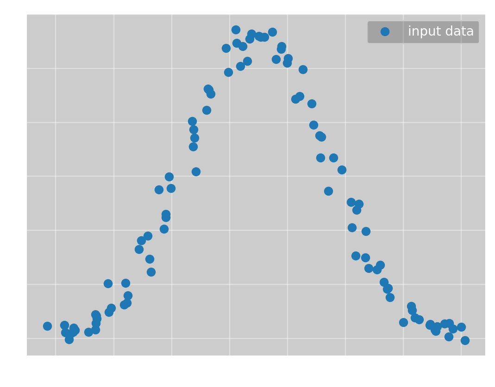

To which we want to fit $f(x; a, \mu, \sigma) = ae^{-\frac{1}{2}\frac{(x-\mu)^2}{\sigma^2}}$. Here we immediately reach a problem with *Omega Optimizer*; you must calculate the gradient and hessian of $f$ manually. Ideally, this would be done for you, but I have not found a good automatic differentiation tool for rust yet. However, after calculating the derivatives, *Omega Optimizer* can find the optimal parameters with no help. Even starting with all parameters equal to 1, Newton's method quickly converges to the global minimum, giving

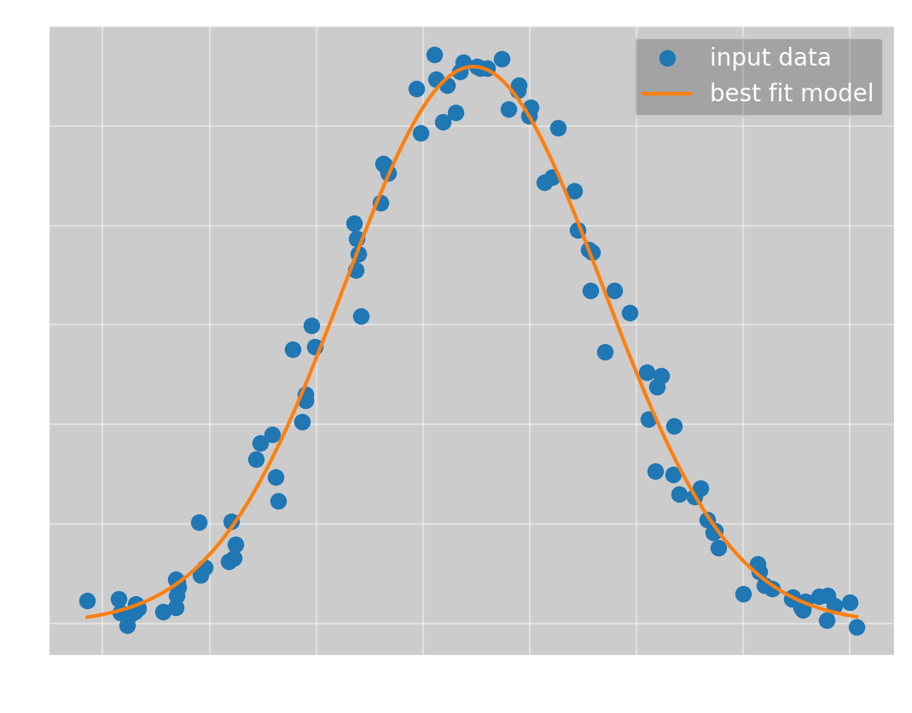

which has the parameters

>($a$, $\mu$, $\sigma$) = ($5.60\pm 0.06$, $2.36\pm 0.07$, $6.05\pm 0.07$)

and a mean squared error of $0.0618$.

### Sine wave

We now want to test a slightly more complicated example, namely a sine wave. We have the data:

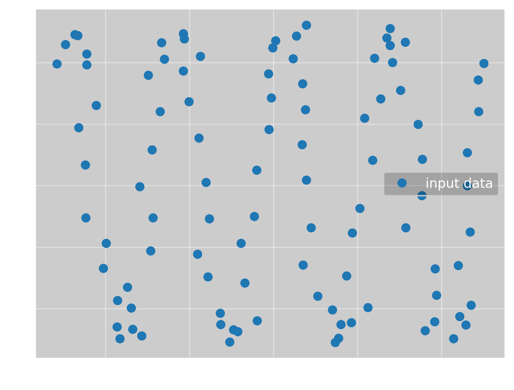

To which we want to fit $f(x; \omega, \phi, a, b) = a\sin(\omega x + \phi) + b$. If we again run *Omega Optimizer* with all parameters equal to 1, we get

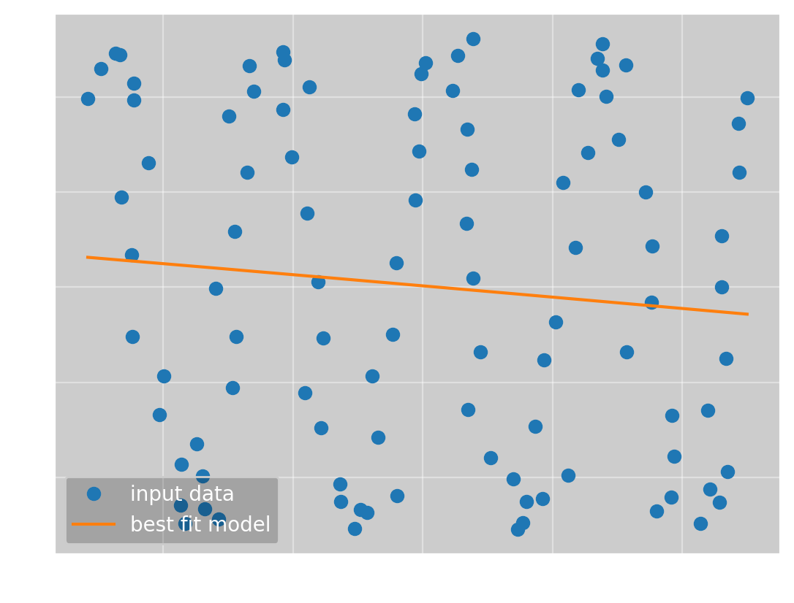

which has the parameters

>($\omega$, $\phi$, $a$, $b$) = (0.13, 2.7, 20, 22)

and a mean squared error of 305. This is obviously not the correct solution, but it is actually the optimal line fit to the data. A straight line is a typical example of a local minimum, so this is not an unexpected result. To get the global minimum, we need better initial parameters. To do this, I have integrated a gui into *Omega Optimizer* where you can change the parameters to get a good starting point: 

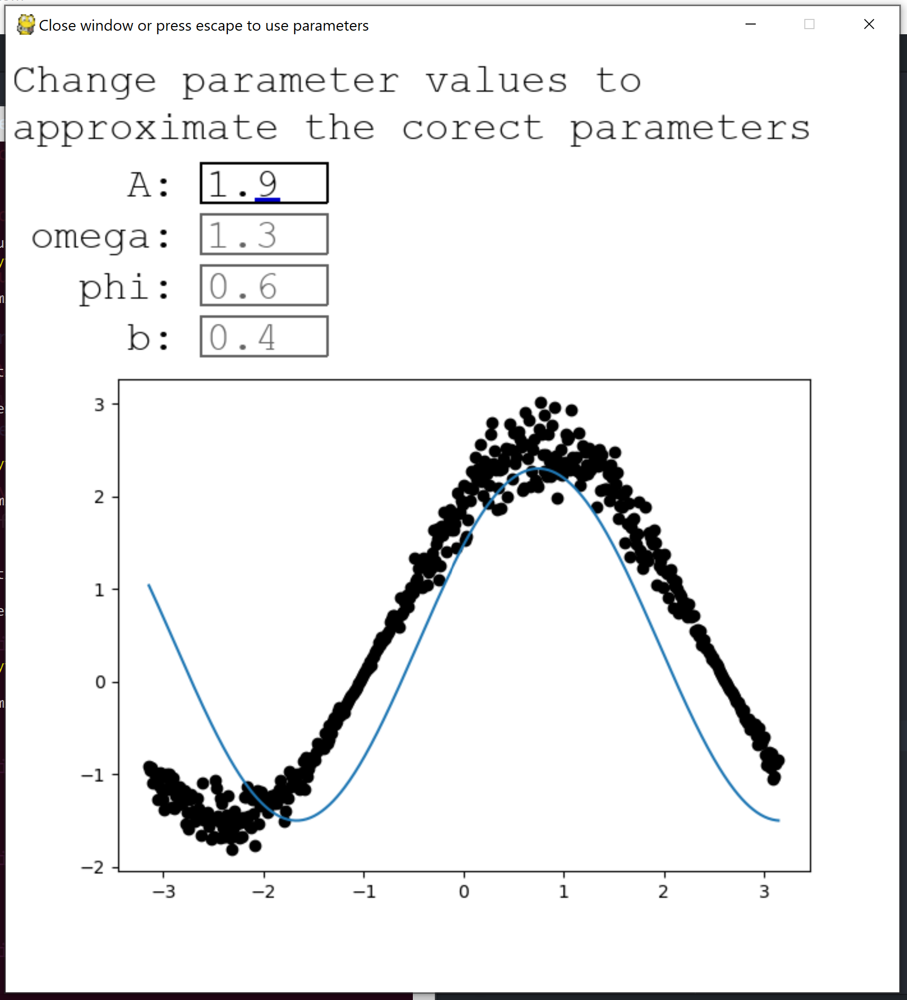

With this, the program converges to the true solution

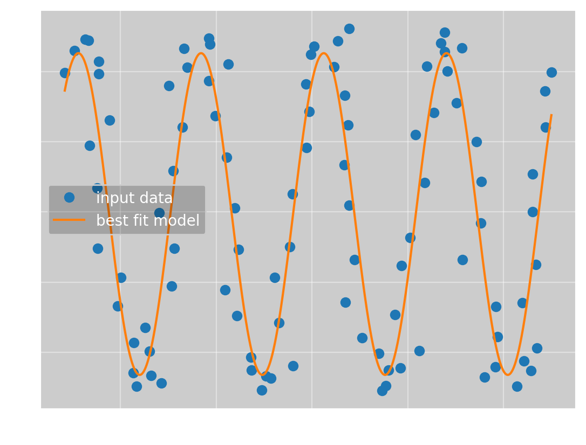

which has the parameters

>($\omega$, $\phi$, $a$, $b$) = ($9.82\pm 0.07$, $0.97\pm 0.05$, $23\pm 1$, $29.7\pm 0.9$)

and an error of 77.4.

For this example, it is only the frequency which made convergence difficult. Even starting at $(10, 1, 1, 1)$ converges to the correct solution. This makes sense, the local line minimum is much closer than the true minimum in $\omega$-space, so that is what the program naturally converges to.

### Mortivated

It is now time to answer the question my brother asked me once and for all. We have the data:

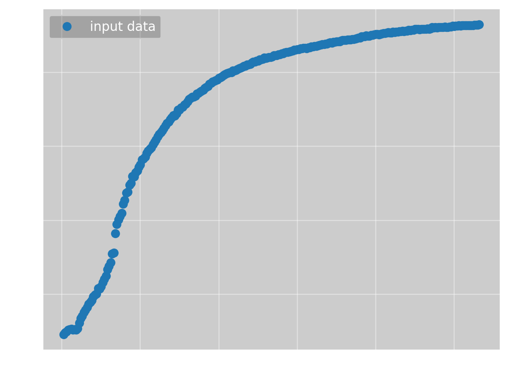

To which we want to fit $f(x; a, b, c, n) = \frac{ax^n}{bx^n + 1} + c$. For this function, *Omega Optimizer* can once again find the global minimum starting with all parameters equal to 1, giving

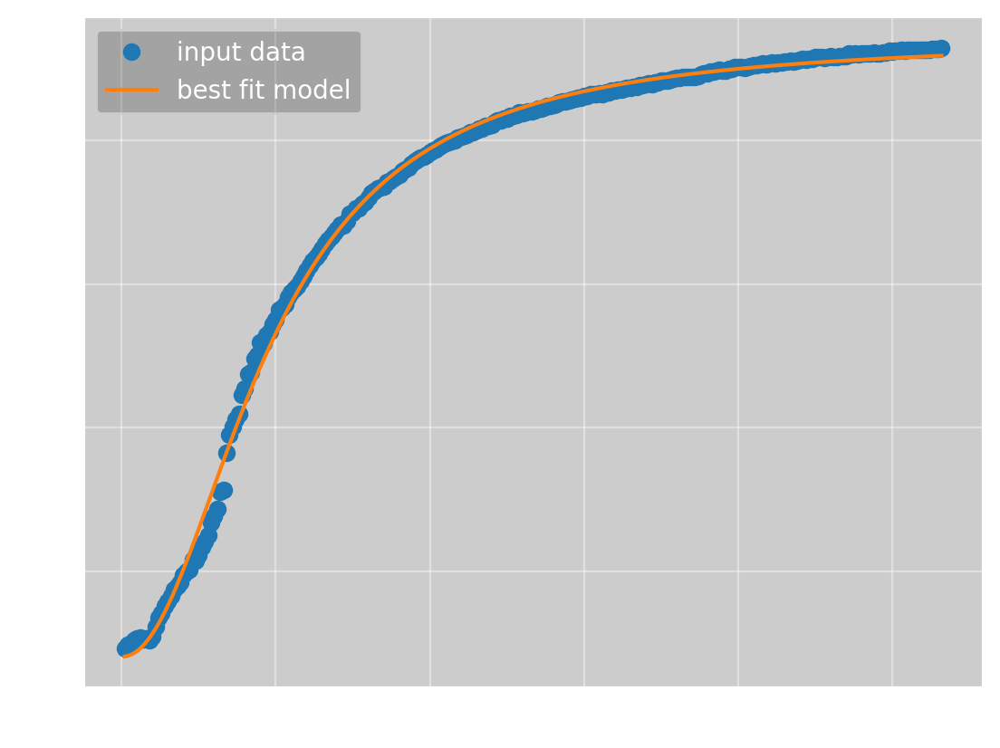

which has the parameters

>($a$, $b$, $c$, $n$) = ($0.29\pm 0.03$, $0.00033\pm 0.00003$, $80\pm 4$, $2.07\pm 0.03$)

and an error of 141. The parameters I found manually way back when was

> (a, b, c, n) = (0.09, 0.000106, 98, 2.32)

which has an error of 343. This means *Omega Optimizer* not only found the minimum with no manual input, the parameters it found are also more than twice as good as those I found manually.

Looking at the best fit curve, it is obvious it does not actually fit the data perfectly. I don't think this is a problem with the parameters, I think that the data does not actually follow the curve I hypothesized. There are other functions which have a similar shape, such as the logistic function or the error function. However, the function I have found is a good enough approximation of the true function that I don't think it is necessary to use more time on this particular problem.

### Conclusion and further developments

From the examples I have shown, it is clear that *Omega Optimizer* works well. It is written entirely in rust, so it is very fast; for the normal distribution example, it used just 0.884 ms to converge to the solution. It is a bit slower when it does not reach a good minimum since I try $10^4$ gradient descent steps before giving up, with the sine example taking 66.4 ms when trying to converge to a straight line.

However, there are two downsides to the program, which are the two manual parts; calculating the gradient and hessian, and finding good initial parameters. The first problem could be fixed using automatic differentiation, but as the calculation only has to be done once per function, I don't think it is that big of a problem. The other problem has no good solution that I know of. The program is fast enough that I could try many sets of initial parameters, but as we don't have a bounded search space, I don't know how this could be done. The only approach I think might work is a sort of deflation method, but I have not gotten it to work. At the end of the day, using the gui is not that difficult and it is often not necessary, so I think it is a fine solution for now.

If you want to look at the source code for *Omega Optimizer*, it is available at [my github](https://github.com/Emilinya/OmegaOptimizer).

## How it is actually done

As I mentioned in the introduction, non-linear parameter optimization is typically done with an approach that dependents on the specific optimization problem. Here, I want to show how this would be used to find the parameters for the function
$$f(x; a, b, c, n) = \frac{ax^n}{bx^n + 1} + c.$$

The general idea is to go from $y = f(x)$ to $y' = \alpha x' + \beta$, where $y'$ and $x'$ are some transformations of $y$ and $x$. Once the data follows a linear relationship, you can use linear regression to find $\alpha$ and $\beta$, which you can then use to recover your parameters. For example, for data that follows some power law 
$$f(x; a, n) = ax^n,$$
we could take the logarithm of both sides, giving us
$$
\begin{align*}
    \ln(y) &= \ln(ax^n) \\
    &= \ln(a) + n\ln(x)
\end{align*}
$$
That is, if we set $y' = \ln(y)$ and $x' = \ln(x)$, we can use linear regression to find $\ln(a)$ and $n$.

The problem is that this approach only really works if you have two parameters, and we have four. Luckily, we can use some known facts about the function to reduce the number of parameters. The most obvious one is $c$, which is the value where the function crosses the x-axis. From the data points we get that $c\approx 92$. Another thing we can tell is that, as x becomes bigger, $\frac{ax^n}{bx^n + 1}$ approaches the constant $\frac{a}{b}$. If we define
$$\lim_{x\rightarrow\infty} f(x; a, b, c, n) = \frac{a}{b} + c := \bar{y},$$
we find $b = \frac{a}{\bar{y} - c}$. We don't know the exact value of $\bar{y}$,
but from the data we know it is a bit more than $929$. We have now reduced the number of free parameters to 2, so the
next step is to find $y'$ and $x'$:
$$
\begin{align*}
    y &= \frac{ax^n}{\frac{ax^n}{\bar{y} - c} + 1} + c \\
    &= \frac{1}{\frac{1}{\bar{y} - c} + \frac{1}{ax^n}} + c \\
    \implies \frac{1}{y - c} &= \frac{1}{\bar{y} - c} + \frac{1}{ax^n} \\
    \implies \frac{1}{y - c} - \frac{1}{\bar{y} - c} &= \frac{1}{ax^n} \\
    \implies \ln\left(\frac{1}{y - c} - \frac{1}{\bar{y} - c}\right) &= \ln\left(\frac{1}{ax^n}\right) \\
    &= -\ln(a) - n\ln(x)
\end{align*}
$$
So, if we define
$y' = -\ln\left(\frac{1}{y - c} - \frac{1}{\bar{y} - c}\right)$
and $x' = \ln(x)$, we get $y' = \ln(a) + nx'$, just like in the power law example.

If we use $c=92$, $\bar{y}=930$ and find $a$ and $n$ using linear regression, we get

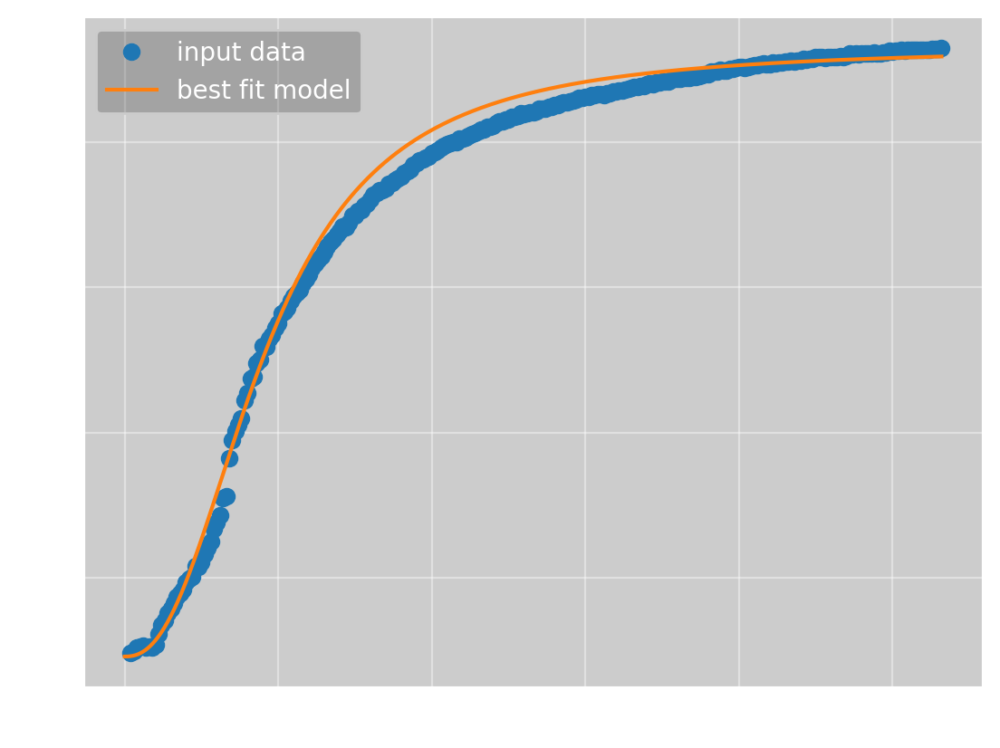

which has the parameters

> (a, b, c, n) = (0.0973, 0.000116, 92, 2.37)

and an error of 422. Certainly not bad, but worse than what *Omega Optimizer* got. To get a better result, we must use a better value for $\bar{y}$. This again requires the use of some optimization method, but the problem is now one-dimensional, and we now have a bounded search space, as we know that the solution should be between $930$ and $1000$. This makes the optimization much simpler. Doing this, we get $\bar{y} = 946$, giving us

which has the parameters

>(a, b, c, n) = (0.273, 0.000320, 92, 2.07)

and an error of 153. This is very close, but still a bit worse than the result from *Omega Optimizer*. I also tried varying the value of $c$, but I could not get a meaningfully better result.

This shows that the 'standard' approach works very well, as expected, but it requires a lot more manual calculation than *Omega Optimizer*. However, this argument would be more convincing if *Omega Optimizer* did not require manual calculation of the derivatives and manual selection of good initial parameters. For this reason, I can't really say which approach is better. One takeaway from this is probably that, to make *Omega Optimizer* easier to use, you should probably parameterize your functions with parameters you know what represent, like using $\bar{y}$ instead of $b$, as this makes finding decent parameters with the gui much easier.
